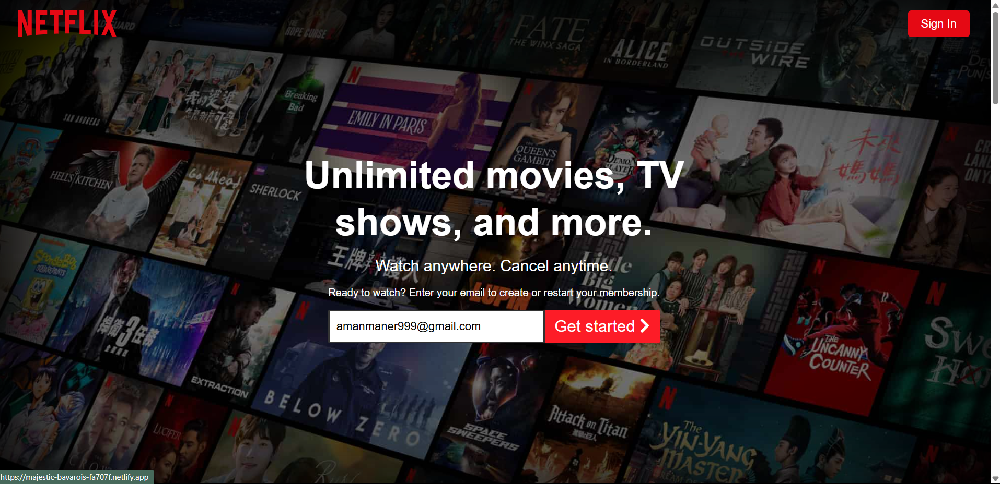
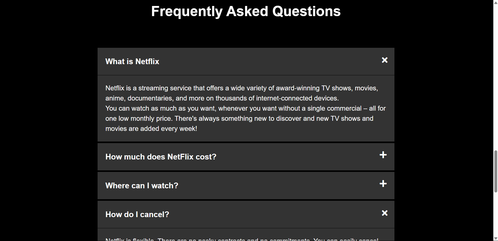
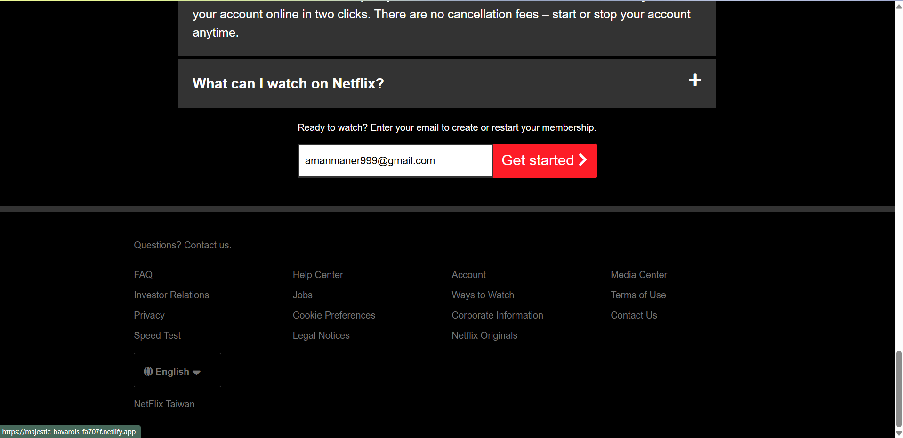

# 🎬 Netflix Clone

A responsive front-end clone of the Netflix homepage created using HTML, CSS, and JavaScript. This project replicates the look and feel of the original Netflix UI with modern styling, layout, and animation effects.

---

## 🚀 Features

- 🎥 Hero section with background image and CTA
- 📱 Fully responsive design for all devices
- 🧭 Navigation bar with logo, links, and sign-in button
- 🎞️ Horizontal movie slider layout
- 💅 Clean and modern user interface

---

## 🛠️ Tech Stack

- HTML5
- CSS3
- JavaScript

---

## 📸 Screenshots

### 🎬 Netflix UI

### ℹ️ About Section

### 🔚 Footer Section

---

### 🚀 Live Demo:
👉 [Click here to view](https://majestic-bavarois-fa707f.netlify.app/)

